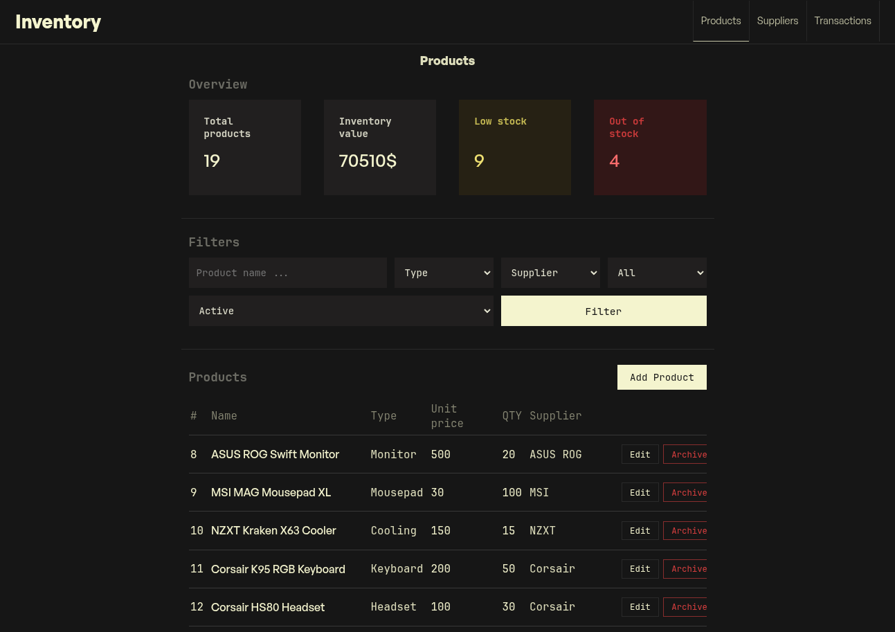
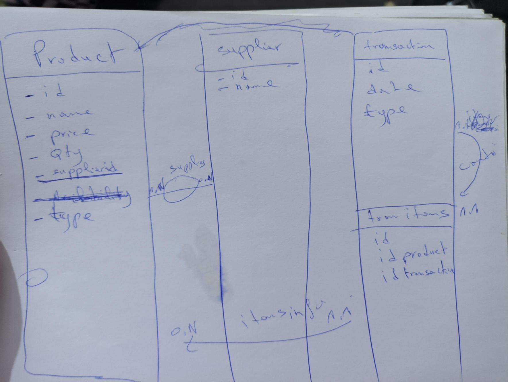
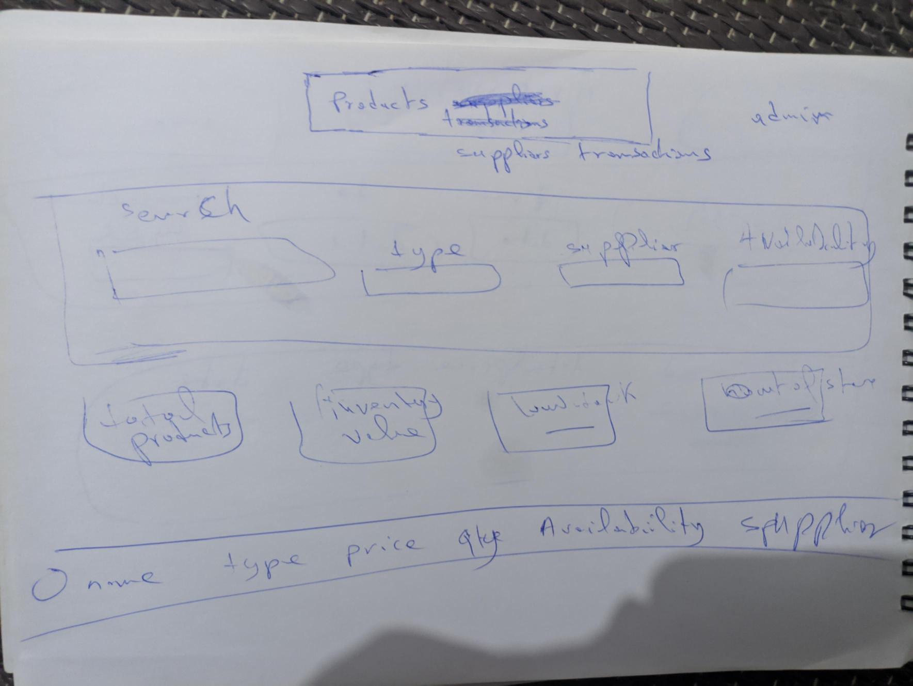

# Inventory Application



A backend-focused inventory management app built to learn Node.js (Express), PostgreSQL, and EJS templating. Supports CRUD operations for products, suppliers, and transactions with admin authentication and archiving products.

## Built With

- **Express 5** — routing, middleware, request handling
- **EJS** — server-side rendering with partials and locals
- **PostgreSQL** — all queries via `pg`

## Database Schema



Four tables with two key relationships:

**`supplier`** ← **`product`**
`product.idsupplier` is a foreign key referencing `supplier.id`. Each product belongs to one supplier; a supplier can have many products. Listing queries `JOIN` these two tables and `GROUP BY supplier` to show a supplier's product count.

**`transaction`** ← **`transaction_items`** → **`product`**
A transaction has a header (`type`, `date`, `location`, `note`) and line items stored in `transaction_items`. Each item links a product with a quantity. The displayed `value` is computed in SQL as `SUM(p.price * ti.qty)`. This is a many-to-many bridge — one transaction can reference multiple products, and a product can appear in many transactions.

`

## Features

- **Dashboard overviews** — inventory value, low-stock / out-of-stock counts (products), best supplier by volume (suppliers), 30-day inflow vs outflow (transactions)
- **Multi-filter search** — each listing page has dynamic filters (name, type, supplier, availability, date range, archive status) that build the SQL WHERE clause on the fly
- **archive** — every entity uses an `archived` boolean toggle instead of hard deletion
- **Admin auth** — simple password gate via `.env` (no sessions, no cookies)

## Tricky Parts

### Archive / soft-delete

Every "delete" action actually runs:

```sql
UPDATE product SET archived = NOT archived WHERE id = $1;
```

This toggles the boolean so the same button both archives and unarchives. All `SELECT` queries include `WHERE archived IS NOT TRUE` by default. When `showArchived=true` is passed in the query string, the clause is omitted so archived rows appear (with `opacity: 0.4` in the frontend).

The archive filter is a `<select>` inside each listing's filter form, submitted as a query parameter alongside other filters.

### Admin auth

Login is handled by `controllers/getAdmin.js`: compare the submitted password against `process.env.ADMIN_PASSWORD`, and if it matches, set `global.isAdmin = true`. A middleware makes this available to all EJS templates via `res.locals.isAdmin = global.isAdmin`. There is no logout mechanism — restarting the server resets the flag.

### Dynamic SQL builders

Each listing page has a "filtered" query function that assembles SQL clauses conditionally:

```
getProductsFiltred(req.query)  →  WHERE clauses for name (ILIKE), type, supplier, availability
getSuppliersFiltred(req.query) →  WHERE + HAVING clauses
getTransactionsFiltered(req.query) →  WHERE clauses for date range
```

Parameters are collected into an array and passed to `pool.query(queryString, parameters)` to prevent SQL injection. The `paramsCounter` pattern tracks `$1, $2, ...` numbering.

## Page Layout



Each listing page shares the same structure:

1. **Header** — nav with active state indicator (bottom border)
2. **Big title**
3. **Overview cards** — aggregated data relevant to the entity
4. **Filter bar** — form with inputs, selects, and an archive dropdown (admin only)
5. **Table** — rows with edit/archive action buttons (admin only), archived rows are dimmed
